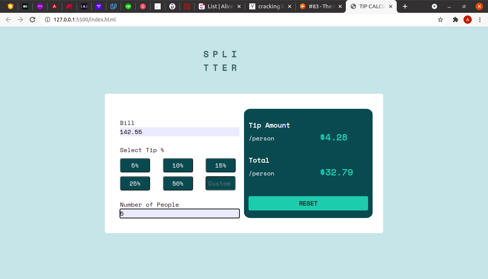

# Frontend Mentor - Tip calculator app solution

This is a solution to the [Tip calculator app challenge on Frontend Mentor](https://www.frontendmentor.io/challenges/tip-calculator-app-ugJNGbJUX). Frontend Mentor challenges help you improve your coding skills by building realistic projects.

## Table of contents

- [Overview](#overview)
  - [The challenge](#the-challenge)
  - [Screenshot](#screenshot)
  - [Links](#links)
- [My process](#my-process)
  - [Built with](#built-with)
  - [What I learned](#what-i-learned)
  - [Continued development](#continued-development)
  - [Useful resources](#useful-resources)
- [Author](#author)


## Overview
This tip calculator application allows the users to input their bill amount (up to 2 decimal places), select the tip percent i.e. 5%, 15% etc, the user can also enter the custom input tip percentage. The user also enters the number os people who will share the cost/tip percent.

The user will be able to determine the cost per person and the tip payable per person. 

### The challenge

Users should be able to:

- View the optimal layout for the app depending on their device's screen size
- See hover states for all interactive elements on the page
- Calculate the correct tip and total cost of the bill per person

### Screenshot




### Links

- Solution URL: [Add solution URL here](https://your-solution-url.com)
- Live Site URL: [Add live site URL here](https://your-live-site-url.com)

## My process
AT the beginning of this project, I looked at the designs and mapped out what skills and resources that I would use to create the application. I created the content/skeleton of the application and then created the outline of the application using bootstrap and CSS. After that, I created the functionality of the application by use of vanilla Javascript. 

### Built with

- Semantic HTML5 markup
- CSS custom properties
- Bootstrap
- Vanilla Javascript
- Flexbox
- Mobile-first workflow
- [Styled Components](https://styled-components.com/) - For styles


### What I learned
I learnt how to get the value of a button from the button. The buttons were created in an array and I created a function that extracts the value of the button clicked in the array. This function is called when a button is clicked.

I also learnt how to prevent negative values in form inputs

I am proud of this code:
```js

function getTip(e){

    tip=parseInt(e.value)
    tip=tip/100
    console.log(tip)

    getTotalCost()
}
```

### Continued development
When creating this project, I struggled with responsiveness of the application to different screen sizes. I will continue to work on my responsiveness to improve and refine my skills to create highly responsive applications. 


### Useful resources

- [How to only enter positive integers on form inputs](https://stackoverflow.com/questions/31575496/prevent-negative-inputs-in-form-input-type-number) - This helped me for figure out how to ensure that the form amounts were only positive values. I would recommend this resource to anyone looking to incorporate this concept.
-[How to check if an integer is negative in value in Javascript](https://flaviocopes.com/how-to-check-value-is-number-javascript/) - This helped me know how to use isNaN() method to check if a value is not a number when giving output. I was able to create an if statement that shows consistent output at $0.00 until all values are entered into the app

## Author

- Website - [Tip Calculator](https://www.your-site.com)
- Frontend Mentor - [Alice Githui](https://www.frontendmentor.io/profile/Alice-Githui)


